##### These procedure steps will be followed on the simulator

1. When you click on a Air Velocity using Vane Anemometer file, a new window will open as shown below. Click on the NEXT button at the bottom right corner to proceed to the next step.  
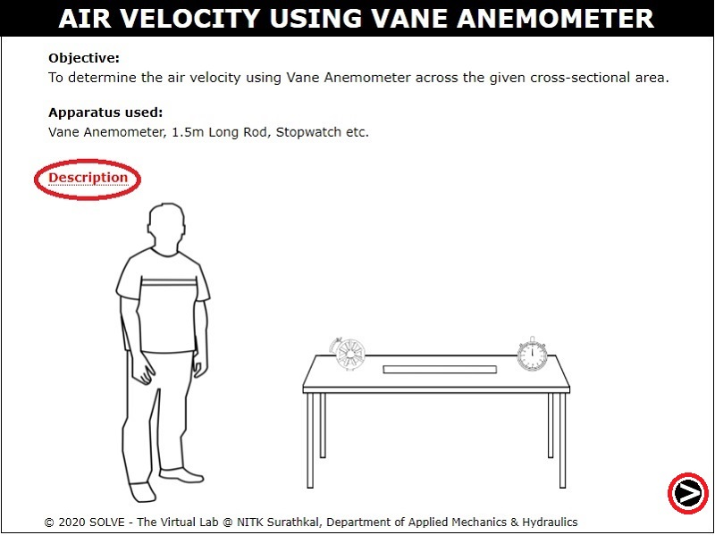 

2. click on the rod to attach to the Vane Anemometer for rotation. 
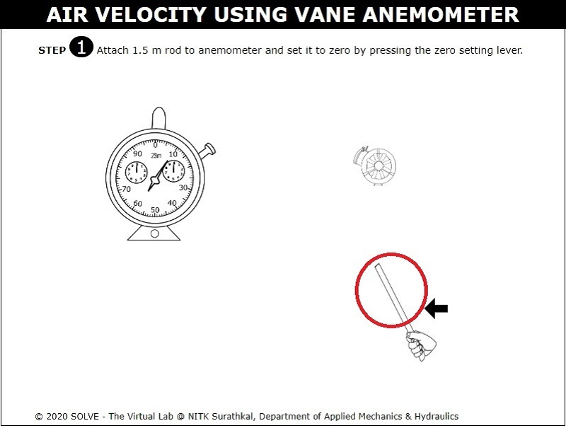 

3. Then, click the Zero Setting lever to set it to zero. Then, click the NEXT button. 
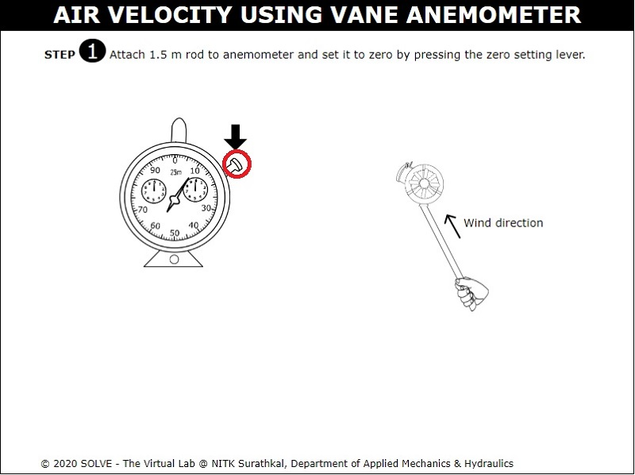 

4. Then, click on the OK button.  
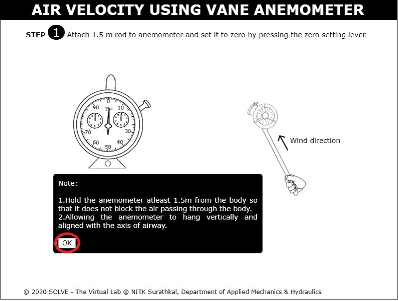 

5. Click on the NEXT button at the bottom right corner to proceed to the next step. 
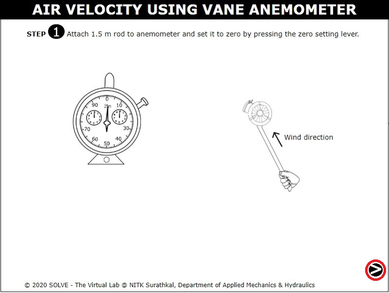 

6. Then, click on the OK button. 
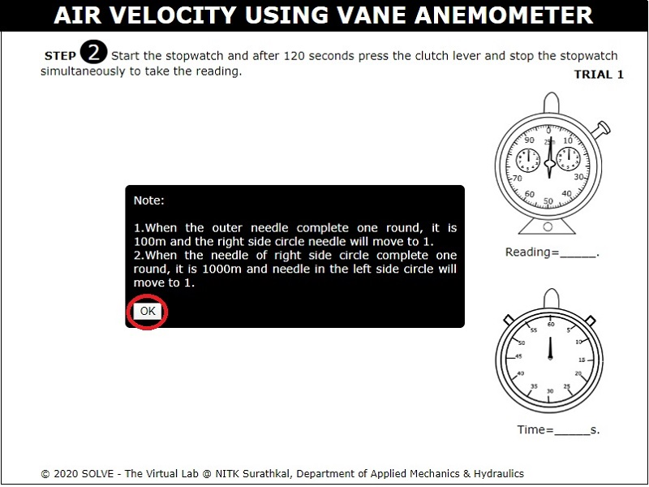 

7. Now, click on the start button of stopwatch to switch it ON which will run for 120sec. 
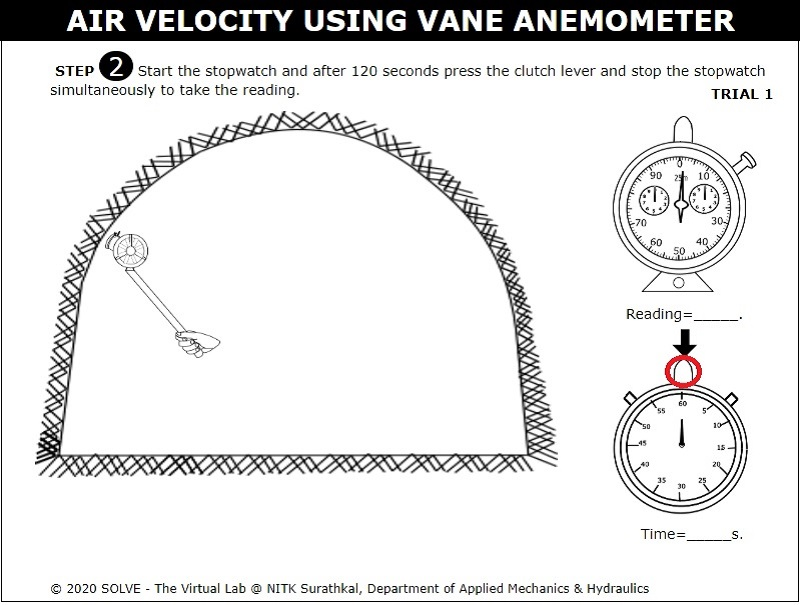 

8. Then, click on the clutch button of vane anemometer when time finished so that reading would not change even the vane of anemometer is moving. 
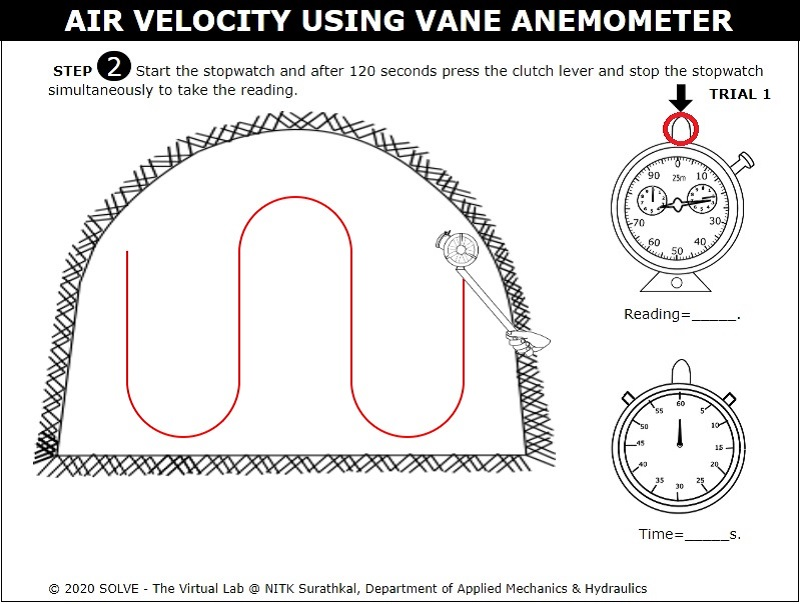 

9. Click on the NEXT button at the bottom right corner to proceed to the next step. 
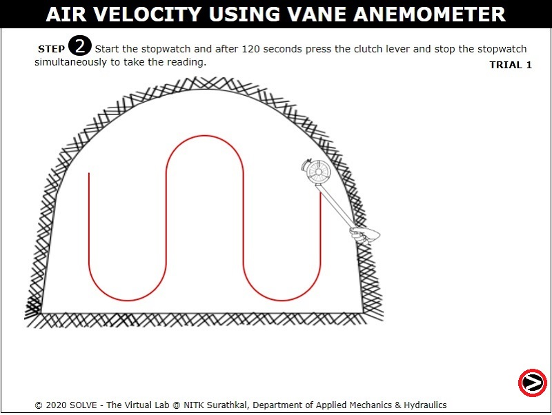 

10. The observation of trial 1 is given below and click on the CHECK button to get result of trial 1. 
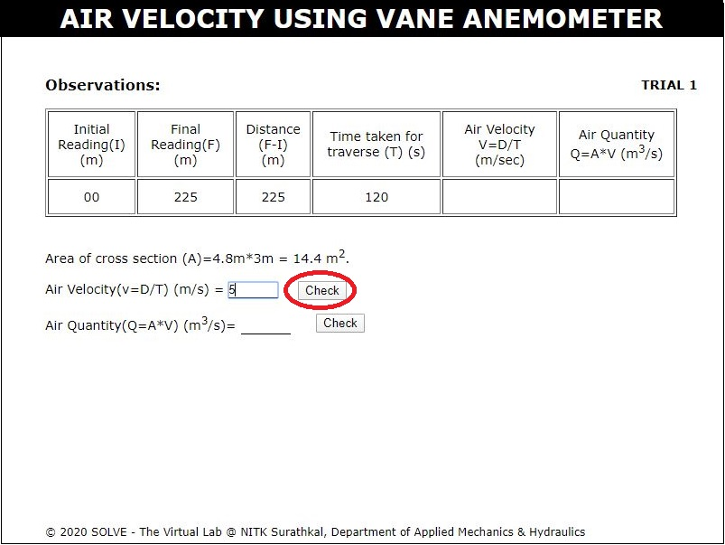 

11. Click on the right bottom corner button to take reading of other trails also by repeating the above procedure mentioned for Trial 1. 
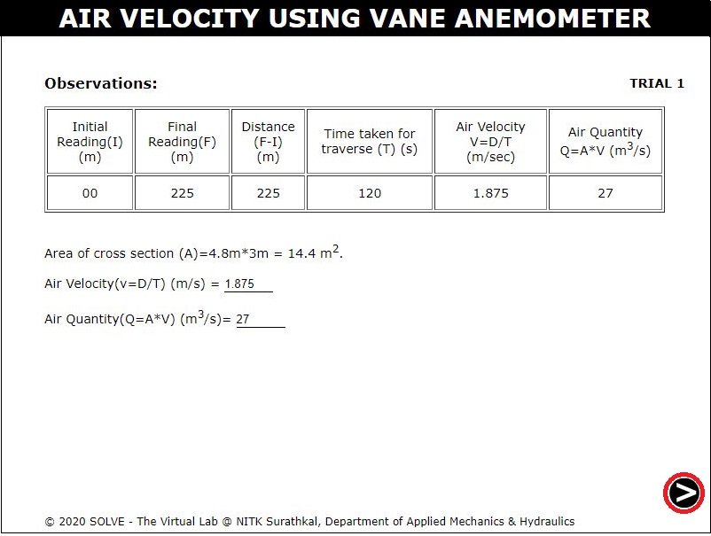 

12. Observation table for all trials are given below after taking reading of each trial  and click on the CHECK button to get the result of actual air velocity. Click on the NEXT button at the bottom right corner to proceed to the next step.  
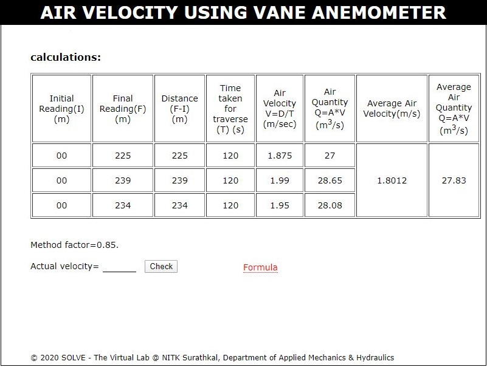 

13. Final result of  air velocity measured by anemometer and actual velocity is calculated and noted below. 
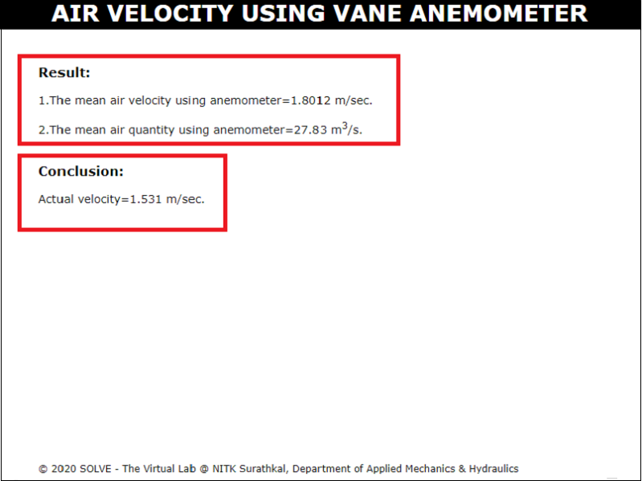 
